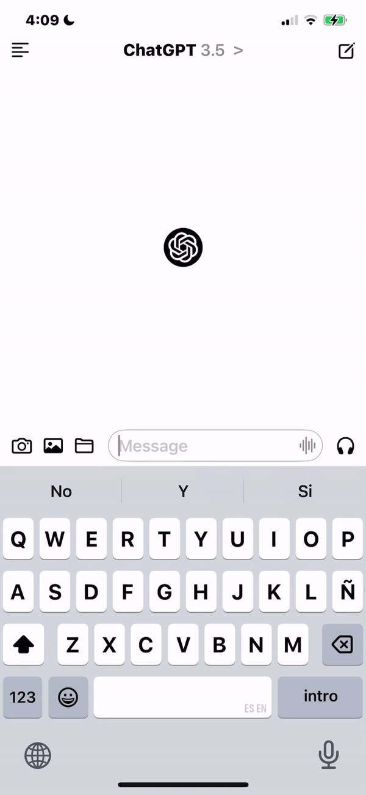

# 🤖 ChatGPT iOS Clone

This is an iOS app that replicates the ChatGPT experience, built with **SwiftUI** and connected to the **OpenAI API** for real-time AI-driven conversational capabilities. The app provides a clean and user-friendly chat interface, perfect for learning or demonstrating API integration with Swift.

---

## 🌟 Features

- **AI-Powered Conversations**  
   Engage in real-time chats powered by OpenAI's language model.
- **Polished UI**  
   Designed with **SwiftUI** for a smooth and intuitive user experience.
- **Customizable API Integration**  
   Easy to set up with your own OpenAI API key.

---

## 🛠️ Tech Stack

- **SwiftUI**: For declarative and modern UI design.
- **OpenAI API**: Powers the conversational functionality.

---

## 🛠️ How to Run the Project

Follow these steps to clone and set up the project:

1. **Clone the Repository**  
   Open your terminal and run:
   ```bash
   git clone https://github.com/acalderon20/chatGPT_clone.git
   cd chatGPT_clone

2. **Replace the API Key**  
   - Obtain your OpenAI API key from the [OpenAI Platform](https://platform.openai.com/).  
   - Open the project in Xcode and replace the placeholder `"API_KEY"` in the code with your actual API key in an environment variable.

3. **Open in Xcode**  
   - Locate the `.xcodeproj` file and open it with Xcode:
     ```bash
     open chatGPT_clone.xcodeproj
     ```

4. **Run the App**  
   - Select your target device or use the simulator in Xcode.  
   - Press the **Run** button or use the shortcut `Cmd + R`.

---

## 🎥 Demo

### Chat Functionality in Action  


---

## 🧠 What I Learned

This project demonstrates proficiency in:
- **API Integration**: Connecting and exchanging data with external APIs (OpenAI).
- **SwiftUI Development**: Creating intuitive, scalable interfaces.
- **Asynchronous Programming**: Handling network requests and updating the UI in real-time.
- **Error Handling**: Ensuring smooth user experiences even with API-related issues.

---

## ⚠️ Note

To use this app, you **must replace** the placeholder `API_KEY` with your own OpenAI API key. Ensure you comply with OpenAI’s [usage policies](https://platform.openai.com/policies) while using their API.

---

## 📬 Contact

Feel free to reach out for questions or collaboration opportunities:  
- **GitHub**: [acalderon20](https://github.com/acalderon20)  
- **Upwork**: [Adolfo C. - iOS Developer](https://www.upwork.com/freelancers/~0175776b8126b85eac?mp_source=share)
